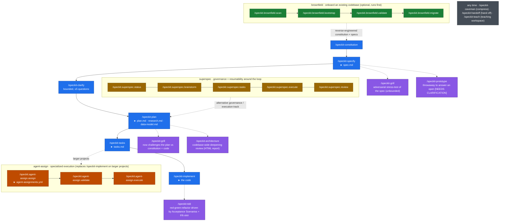

# Workflow

How the **csc** extension changes the way you work in a spec-kit project. This is the
end-to-end picture: the stock spec-kit phases, the seven extension commands that slot into
them, and the one-command `csc` bootstrapper that sets the whole thing up.

If you just want the command reference, see the [README](README.md). This file is about
*when* you reach for each piece and *why*.

---

## 0. Bootstrap — `csc init`

Before any of the workflow below exists, you need a spec-kit project with the extensions and
MCP servers wired in. The `csc` CLI collapses the old manual dance (`specify init` → install
each extension → hand-edit MCP config per agent) into one command:

```bash
csc init my-project --ai both
```

This does, in order:

1. **`specify init`** for the first agent, then layers the second agent on top with
   `--here --force` (so `--ai both` gives you a project both Claude Code and Codex understand).
2. **Installs the configured extensions** — by default `csc` (this repo, the seven commands
   in §3) plus three third-party extensions that each add their own sub-workflow:
   [`brownfield`](https://github.com/Quratulain-bilal/spec-kit-brownfield) (onboard existing
   codebases), [`superspec`](https://github.com/WangX0111/superspec) (governance + status +
   review), and [`spec-kit-agent-assign`](https://github.com/xymelon/spec-kit-agent-assign)
   (route tasks to specialized agents). See §4 for what each contributes. Commands land in
   `.claude/commands/` and skills in `.claude/skills/` for Claude Code; for Codex everything
   is written into the cross-agent `.agents/skills/<name>/SKILL.md` layout (plain commands are
   auto-wrapped into SKILL.md entries).
3. **Writes your MCP servers** into the right place per agent — `.mcp.json` for Claude Code,
   `~/.codex/config.toml` for Codex.
4. **Runs your post-init hooks** (configurable shell commands).

Everything is overridable per-run (`--ai`, `--ext`, `--no-ext`, `--no-mcp`, …) or persistently
via `~/.config/csc/config.json`. To add a single extension to a project that already exists:

```bash
csc add <name|url|zip|path>      # install one extension into the current project
csc ext add|remove|list          # manage the default extension set
csc mcp add|apply|list           # manage MCP servers (stdio + remote)
csc config set|get|edit          # tweak defaults, hooks, sources
```

Once `csc init` finishes you have a normal spec-kit project — the rest of this workflow
applies whether you bootstrapped with `csc` or `specify` directly.

---

## 1. The spec-kit phases (unchanged)

The extension does **not** replace the core spec-kit loop. Stock spec-kit still owns the
backbone:

| Phase | Command | Produces |
|---|---|---|
| Principles | `/speckit-constitution` | `.specify/memory/constitution.md` |
| Specify | `/speckit-specify` | `specs/<feature>/spec.md` |
| Clarify | `/speckit-clarify` | resolves `[NEEDS CLARIFICATION]` (≤5 Qs) |
| Plan | `/speckit-plan` | `plan.md`, `research.md`, `data-model.md` |
| Tasks | `/speckit-tasks` | `tasks.md` |
| Analyze | `/speckit-analyze` | read-only consistency report |
| Implement | `/speckit-implement` | the code |

The csc commands are **never** substitutes for these. Nothing in the extension generates
`tasks.md` or emits the `/speckit-analyze` audit — the extension fills the *gaps between*
these phases with deeper, less-bounded tooling.

---

## 2. Where everything slots in

Read this as the core spec-kit spine (blue) with the seven csc commands (purple) hung off the
phases they augment, plus the three bundled extensions: **brownfield** (green) onboarding an
existing codebase *before* the loop, **agent-assign** (orange) swapping in for the execution
phase, and **superspec** (gold) as a governance track wrapping the whole thing. The diagram
renders on GitHub; details for each command are in §3 (csc) and §4 (bundled extensions).



### Clarification: `/speckit-clarify` vs `/speckit-grill`

These two look similar but sit at opposite ends of the spectrum — pick by how much rigor the
spec needs:

| Command | Scope | Mode |
|---|---|---|
| `/speckit-clarify` | ≤5 structured questions resolving `[NEEDS CLARIFICATION]` | bounded, editing |
| `/speckit-analyze` | consistency report across artifacts | read-only audit |
| **`/speckit-grill`** | every branch of the design tree, challenged against constitution + code | **unbounded, adversarial, editing** |

Use `/speckit-clarify` to mop up the obvious gaps quickly. Use `/speckit-grill` when the
feature is high-stakes and you want every assumption attacked until the design holds.

---

## 3. The seven csc commands in detail

| Command | When you reach for it | Reads | Writes |
|---|---|---|---|
| **`/speckit-grill`** | The spec or plan feels under-examined; you want it attacked branch by branch. | constitution, `spec.md`, `plan.md`, `research.md`, code | `spec.md`, `plan.md`, `research.md` (decisions written back inline as they crystallise) |
| **`/speckit-architecture`** | You suspect shallow modules / missed abstractions across the codebase. | constitution, Key Entities across `specs/*/spec.md`, `specs/*/research.md`, code | owning feature's `spec.md` Key Entities / `research.md`; offers `/speckit-specify` for accepted refactors |
| **`/speckit-tdd`** | Implementing a feature test-first, with each test tracing back to a requirement. | constitution, `spec.md`, `plan.md`, `research.md`, `tasks.md` | `tasks.md` ticks, new `FR-###`/Edge Cases, `research.md` decisions |
| **`/speckit-prototype`** | An open question (`[NEEDS CLARIFICATION]`) needs a runnable answer, not more discussion. | `spec.md` markers, `plan.md`, `data-model.md` | resolves the marker in place; `research.md`, `data-model.md` |
| **`/speckit-teach`** | You want a stateful, multi-session teaching workspace (mission, lessons, glossary). | constitution + Key Entities when teaching the project's own domain | its own workspace files only |
| **`/speckit-caveman`** | You want ~75% fewer tokens without losing technical accuracy. | — | — |
| **`/speckit-handoff`** | Ending a session; you want a handoff doc anchored to the active feature. | feature state (`spec.md`/`plan.md`/`tasks.md` presence) | a handoff file in the OS temp dir |

You can invoke each as a slash command, or just describe the intent in natural language
("grill me on this spec", "find deepening opportunities", "TDD this task", "prototype this",
"caveman mode", "write a handoff") — the matching skill auto-triggers.

---

## 4. The other bundled extensions

`csc init` installs three more extensions alongside the csc commands. Unlike the seven csc
commands — which are deliberately *spec-kit-native* and route every writeback into existing
artifacts (§5) — these are independent third-party tools, each with its own command namespace
(note the `.` separators) and its own sub-workflow. Use them when the situation calls for it;
they are not required on every feature.

### brownfield — adopt SDD in an existing codebase

For when you're bringing spec-kit to a project that *already has code*, rather than starting
green-field. A four-command sequence run **before** the normal loop:

| Command | Does | Produces |
|---|---|---|
| `/speckit.brownfield.scan` | Auto-discovers tech stack, frameworks, architecture, naming conventions | project profile (read-only) |
| `/speckit.brownfield.bootstrap` | Generates spec-kit config derived from the actual codebase | constitution, spec/plan templates, `AGENTS.md` |
| `/speckit.brownfield.validate` | Confirms bootstrap output matches reality; detects drift | validation report (read-only) |
| `/speckit.brownfield.migrate` | Reverse-engineers specs from existing code + tests | reconstructed `spec.md`, `plan.md`, `tasks.md` |

Flow: **scan → bootstrap → validate → migrate**, then you're in the normal §1 loop with a
constitution and specs that reflect the code you already have.

### superspec — governance, status, and review around the loop

Adds project-governance and resumability commands that wrap the core loop:

| Command | Does |
|---|---|
| `/speckit.superspec.status` | Shows progress and recommends the next action — resume from any interruption |
| `/speckit.superspec.brainstorm` | Deep edge-case / boundary exploration to refine the spec (iterates with plan) |
| `/speckit.superspec.tasks` | Phased task breakdown with execution markers |
| `/speckit.superspec.execute` | TDD-disciplined implementation with subagent coordination |
| `/speckit.superspec.review` | Verifies the code against spec requirements + acceptance criteria |

Its `brainstorm` overlaps in spirit with `/speckit-grill` (both pressure-test the spec) and its
`execute` with `/speckit-tdd` — superspec leans toward orchestration/governance, the csc
commands toward depth on a single artifact. Pick whichever fits; don't run both on the same step.

### spec-kit-agent-assign — route tasks to specialized agents

Slots in **after `/speckit-tasks`** and effectively replaces `/speckit-implement` with a
specialized-execution path: instead of one generalist context building everything, each task
is routed to the best-fit agent.

| Command | Produces |
|---|---|
| `/speckit.agent-assign.assign` | `agent-assignments.yml` mapping each task → best-fit agent (by path, keywords, context) |
| `/speckit.agent-assign.validate` | validation report (coverage, agent existence, assignment integrity) |
| `/speckit.agent-assign.execute` | implements by spawning dedicated subagents for specialized tasks; `default` tasks run inline |

Flow: **tasks → assign → validate → execute**. Reach for this on larger projects where
task-level specialization pays off.

---

## 5. The discipline every csc command follows

This is what makes the extension *spec-kit-native* rather than a bolt-on. Every editing
command obeys the same rules, so writebacks always land in the right artifact and never
sprawl into invented files:

- **Locate the active feature** via
  `.specify/scripts/bash/check-prerequisites.sh --json --paths-only`
  (fallback: `.specify/feature.json`), and always read `.specify/memory/constitution.md`.
- **Phase gate** — a spec-only feature (no `plan.md`) only ever writes to `spec.md`;
  `research.md` is created lazily, never fabricated.
- **Artifact Map** — each editing skill carries an `ARTIFACT-MAP.md` routing every kind of
  resolution to the correct artifact. No skill invents new file types (no `CONTEXT.md`,
  no `docs/adr/`). This is the key adaptation from the upstream skills, which *did* write
  to `CONTEXT.md`/ADRs.
- **Template preservation** — artifacts keep the headings from `.specify/templates/`; skills
  add to sections rather than restructuring them.
- **No sibling duplication** — nothing generates `tasks.md` (that's `/speckit-tasks`) or
  emits the read-only audit (that's `/speckit-analyze`).

---

## 6. A typical end-to-end run

A representative session for a non-trivial feature:

1. `csc init payments --ai both` — bootstrap the project with extensions + MCP.
   *(Existing codebase instead of green-field? Run the brownfield sequence first —
   `/speckit.brownfield.scan → bootstrap → validate → migrate` — to reverse-engineer a
   constitution and specs from the code you already have.)*
2. `/speckit-constitution` — set the project's principles (once per project).
3. `/speckit-specify` — write the feature spec.
4. `/speckit-grill` — attack the spec; resolved decisions land back in `spec.md`.
5. `/speckit-prototype` — for the one open question that needs a runnable answer; the result
   resolves the `[NEEDS CLARIFICATION]` and lands in `research.md`/`data-model.md`.
6. `/speckit-plan` — produce `plan.md`, `research.md`, `data-model.md`.
7. `/speckit-architecture` — sanity-check for shallow modules before committing to the design.
8. `/speckit-tasks` — generate `tasks.md`.
9. `/speckit-implement` + `/speckit-tdd` — build it test-first; each test cites its `FR-###`/`SC`,
   and completed cycles tick the matching task.
   *(On a larger project, route tasks to specialized agents instead:
   `/speckit.agent-assign.assign → validate → execute`.)*
10. `/speckit-handoff` — when the session ends, compact it into a handoff doc for the next agent.

Not every feature needs every step — `/speckit-grill`, `/speckit-architecture`, and
`/speckit-prototype` are the ones you add when the stakes or the uncertainty justify them, and
the brownfield / superspec / agent-assign sub-workflows (§4) come in only when their situation
applies.
```
